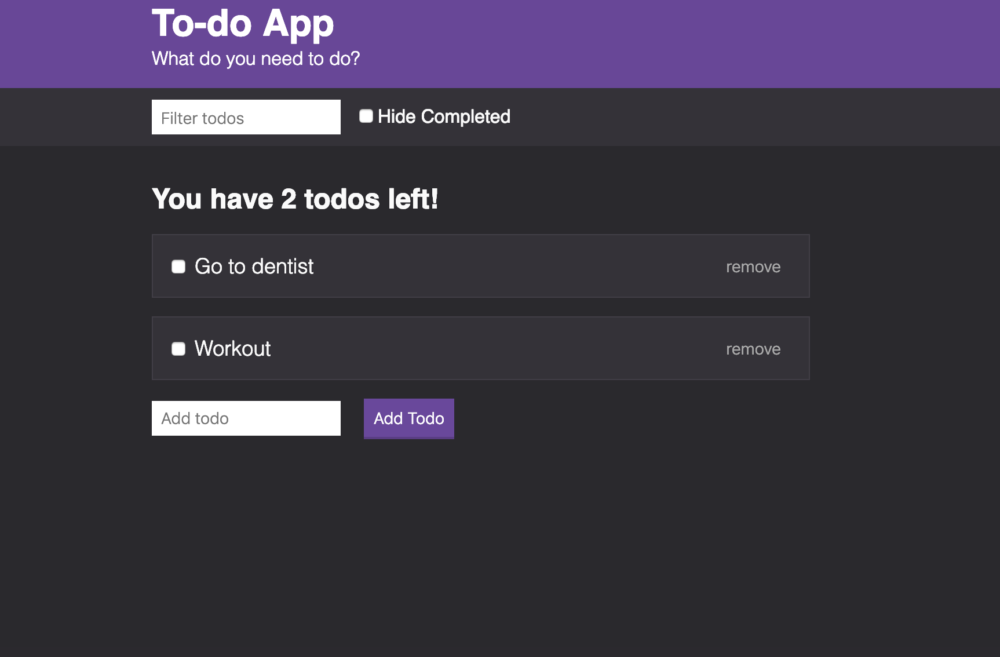

# todo-app
Application for storing tasks/errands. The application utilizes JavaScript, html5 and CSS.

In addition, Webpack and Babel were implemented. Webpack is an open-source JavaScript module bundler. Its main purpose is to bundle JavaScript files for usage in a browser, yet it is also capable of transforming, bundling, or packaging just about any resource or asset. Babel is an open-source JavaScript compiler and configurable transpiler used in web development making your code compatible for older browsers.

